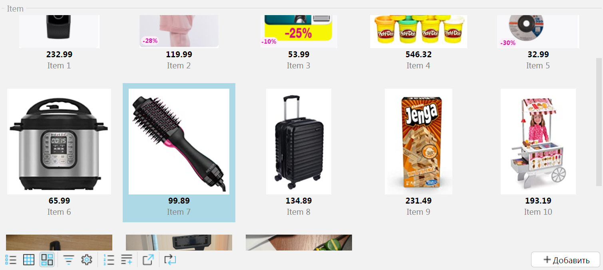

По умолчанию каждый объект на форме с видом представления GRID отображается на форме в виде плоской таблицы со столбцами.
Однако, в платформе существует возможность создавать свои собственные компоненты для визуализации списка объектов.

В качестве наглядного примера рассмотрим задачу по отображению в виде "плитки" списка товаров с изображениями.

### Доменная логика

Для начала создадим классы и свойства товаров, а также форму редактирования:

```lsf
CLASS Item 'Item';

name 'Name' = DATA STRING (Item) NONULL;
price 'Price' = DATA NUMERIC[12,2] (Item) NONULL;
image '' = DATA IMAGEFILE (Item);

FORM item 'Item'
    OBJECTS i = Item PANEL
    PROPERTIES(i) name, price, image
    
    EDIT Item OBJECT i
;

DESIGN item {
    OBJECTS {
        MOVE PROPERTY(image(i)) {
            fill = 1;
        }
    }
}
```
Для каждого товара должны быть заданы наименование, цена и изображение.

### Интерфейс

Создадим форму со списком товаров. Для этого добавим на форму объект _Товар_, его свойства, а также действия по добавлению, редактированию и удалению:
```lsf
FORM items 'Items'
    OBJECTS i = Item CUSTOM 'itemCards'
    PROPERTIES(i) READONLY image, price, name
    PROPERTIES(i) NEWSESSION new = NEW, edit = EDIT GRID, DELETE GRID
;

NAVIGATOR {
    NEW items;
}
```
При помощи ключевого слова **CUSTOM** указывается, что для отрисовки списка товаров должен использоваться не стандартный табличный интерфейс, 
а компоненты, создаваемые функцией _itemCards_. Эту функцию объявим в файле _itemcards.js_, который поместим в папку _resources/web_.
Она будет возвращать объект, состоящий из двух функций: _render_ и _update_.

Функция _render_ принимает на вход контроллер и элемент, внутри которого должны создаваться новые элементы, необходимые для отображения данных:
```js
render: (element, controller) => {
    let cards = document.createElement("div")
    cards.classList.add("item-cards");

    element.cards = cards;
    element.appendChild(cards);
},
```
В данном примере мы создаем новый _div_ _cards_, запоминаем его и добавляем внутрь _element_.

Для обновления отображаемых значений платформа будет каждый раз вызывать функцию _update_, в которую будет передан тот же _element_,
что и в функции _render_, а также список значений _list_:
```js
update: (element, controller, list) => {
    while (element.cards.lastElementChild) {
        element.cards.removeChild(element.cards.lastElementChild);
    }

    for (let item of list) {
        let card = document.createElement("div")
        card.classList.add("item-card");

        if (controller.isCurrent(item))
            card.classList.add("item-card-current");

        let cardImage = document.createElement("img")
        cardImage.classList.add("item-card-image");
        cardImage.src = item.image;
        card.appendChild(cardImage);

        let cardPrice = document.createElement("div")
        cardPrice.classList.add("item-card-price");
        cardPrice.innerHTML = item.price;
        card.appendChild(cardPrice);

        let cardName = document.createElement("div")
        cardName.classList.add("item-card-name");
        cardName.innerHTML = item.name;
        card.appendChild(cardName);

        element.cards.appendChild(card);

        card.onclick = function(event) {
            if (!controller.isCurrent(item)) controller.changeObject(item);
        }
        card.ondblclick = function(event) {
            controller.changeProperty('edit', item);
        }
    }
}
```
Так как функция _update_ вызывается каждый раз, когда изменяются данные, то первым делом происходит удаление всех ранее созданных элементов (а именно карточек товаров).

В данном примере используется самая простая схема обновления, но при необходимости ее можно оптимизировать путем обновления DOM только для изменившихся значений.
Для этой цели у _controller_ есть метод _getDiff_, в который параметром нужно передать новый список объектов _list_. 
Этот метод в качестве результата вернет объект с массивами _add_, _update_, _remove_, в которых будут храниться соответственно добавленные, изменившиеся и удаленные объекты.
Пример:
```js
let diff = controller.getDiff(list);
for (let object of diff.add) { ... }
for (let object of diff.update) { ... }
for (let option of diff.remove) { ... }
```

После удаления старых элементов для каждого объекта из массива _list_ создается свой _div_ _card_, в который помещаются нужные элементы отображения каждого свойства.
Названия полей объектов соответствуют названию свойств на форме. При помощи метода _isCurrent_ определяется, какой объект из списка является текущим.

В самом конце функции добавляются обработчики нажатия кнопки мыши на карточку товара. 

По одиночному нажатию у контроллера вызывается метод _changeObject_, 
который изменяет текущий объект. Второй параметр (_rendered_) не указывается (то есть считается равным _false_), что означает, что сервер должен в итоге вызвать функцию _update_ с новым списком объектов (возможно тем же). 
Так как значение метода _isCurrent_ изменится, то повторное создание карточек товаров изменит текущий выделенный объект в интерфейсе.

По двойному нажатию вызывается метод _changeProperty_, который изменяет текущее значение свойства _edit_ для объекта, переданного вторым параметром.
Поскольку _edit_ является действием, то третий параметр - значение, на которое необходимо изменить текущее значение свойства, не передается, и вместо изменения будет произведен вызов этого действия. 
В данном случае будет открыта форма редактирования товара.

Чтобы объединить функции _render_ и _update_ в одну, создается функция _itemCards_, которая возвращает их внутри одного объекта:
```js
function itemCards() {
    return {
        render: function (element, controller) => {
            ...
        },
        update: function (element, controller, list) {
            ...
        }
    }
}
```

Для завершения настройки дизайна создадим файл _itemcards.css_, которую также поместим в папку _resources/web_:
```css
.item-cards {
    display: grid;
    grid-template-columns: repeat(auto-fit, minmax(150px, 1fr));
    grid-auto-rows: 200px;
    grid-gap: 10px;
}

.item-card {
    cursor: pointer;
    display: flex;
    flex-direction: column;
    overflow: hidden;
    align-items: center;
    padding: 8px;
}
.item-card-current {
    background-color: lightblue;
}

.item-card-image {
    flex: 1;
    min-height: 100px;
}

.item-card-price {
    font-weight: bold;
}

.item-card-name {
    color: gray;
}
```

Для того, чтобы при открытии страницы в браузере, загрузились созданные js и css файлы, нужно добавить их инициализацию в действии _onWebClientLoad_ при помощи оператора [INTERNAL](INTERNAL_operator.md) :
```lsf
onWebClientLoad() + {
    INTERNAL CLIENT 'itemcards.js';
    INTERNAL CLIENT 'itemcards.css';
}
```

В результате получившаяся форма будет выглядеть следующим образом:
